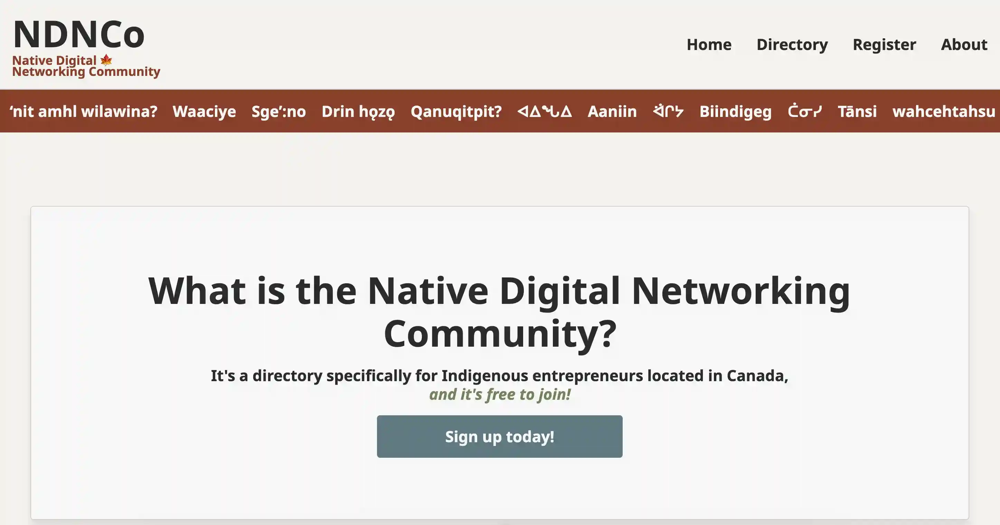

# NDNCo - Native Digital Networking Community

> The idea: a business directory and community platform for Indigenous entrepreneurs, creators, and professionals to connect, share, and thrive.

---

## About

**NDNCo** was originally built as a capstone project, for the BrainStation Software Engineering bootcamp, with a simple mission: to make space for Indigenous-led businesses and communities to connect online.

While many Indigenous directories exist, they're often aimed at non-Indigenous shoppers. NDNCo takes a different approach. It's designed for Indigenous people, as a space to:

- Celebrate Indigenous business
- Support collaboration between entrepereneurs
- Uplift community through culturally conscious tech

This project marked a turning point in my growth as a developer, and it continues to inspire how I think about tech and community.

---

## Core Features (Built)

- Business registration
- Admin login
- Filterable business directory (categories + subcategories)
- Business profiles (contact info, socials, etc.)
- Basic listing management

---

## Planned Features (Stretch Goals)

These were part of the long-term vision for NDNCo:

- Community-led business verification badges
- User roles (general, business, admin, mod)
- Business reviews (star or feather system)
- Mapping features using Leaflet + OSM
- Resources section (grants, cultural info, legal help)
- Community hubs for events, job boards, and collaboration

---

## 🛠 Tech Stack

### Frontend

### Backend

---

## Data Models (Highlights)

### Business Profile

- Name, description, category/subcategories
- Contact info: phone, email, website, social
- Location: general (on/off reserve)
- Hours, year established
- Open to: partnerships, hiring, funding
- Products/services, certifications, awards
- Profile photo/logo (planned)
- UUID

### User Profile

- Name, email, username
- Hashed password (bcrypt)
- User role (admin, mod, business owner, general)
- Profile photo (planned)
- Community affiliation
- Favorite businesses
- UUID

---

## API Overview

### Current

- `GET /businesses` - Get all business listings
- `GET /businesses/:id` - Get single business by ID
- `POST /businesses` - Create a new business listing
- `PUT /businesses/:id` - Edit a business listing (admin)

### Future

- `POST /users` - Register a new user
- `PUT /users/:id` - Update a user profile
- `PUT /businesses/:id` - Edit a business listing (user)

The goal is to allow authenticated users (business owners) to manage their listings through linked foreign keys.

---

## Project Status

NDNCo was built as a functional MVP with core features complete, and backend infrastructure in place. While development paused after the capstone, this project remains a meaningful part of my developer journey.

It represents:

- My early experience with full-stack development
- My values around community, representation, and tech-for-good
- A foundation I may return to in the future
- It was also inspiration for my IndigiTech Capstone: [Lightling Labs](https://github.com/kalwilson/lightling-labs)

---

## Reflection

I was nervous to share this, but I've realized how much this project represents my roots as a developer. It shows initiative, cultural respect, and real-world planning, even if the execution wasn't perfect.

**Growth happens in public.**
And this was a big first step.

---

## Contact

Want to connect, collaborate, or just say hello?
Reach me at [kalwilson.dev@gmail.com](mailto:kalwilson.dev@gmail.com)
Portfolio: [kalwilson.github.io](https://kalwilson.github.io)
